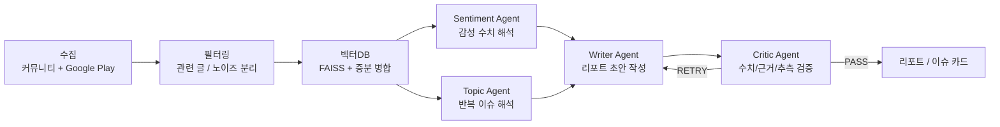

# ENTER-AI

> 리뷰는 AI가 읽고, 서비스팀은 중요한 카드만 봅니다.

ENTER-AI는 온라인 리뷰와 커뮤니티 글을 수집해 노이즈를 걷어내고,
반복되는 사용자 신호를 이슈 단위로 묶어 리포트와 액션 카드로 바꾸는
AI 워크플로우 프로젝트입니다.

처음에는 4개 커뮤니티와 구글 리뷰를 크롤링해 여론 분석 PDF를 만드는
시스템으로 시작했습니다. 이후 실제 데이터 품질을 점검하면서 방향을
다시 잡았고, 현재는 **Review Signal Agent**라는 제품 방향으로 발전시키고
있습니다.

## 지금 만들고 있는 것

**Review Signal Agent**는 앱 리뷰, 커뮤니티 글, 고객 피드백에서
제품팀이 오늘 봐야 할 신호만 골라내는 ReviewOps Agent입니다.

단순히 리뷰를 예쁘게 요약하는 것이 아니라, 아래 흐름을 자동화하는 것이
목표입니다.

1. 리뷰와 공개 피드백을 수집한다.
2. 짧은 칭찬, 욕설, 중복, 무관한 글을 걸러낸다.
3. 반복되는 불만/기능 요청/장애 신호를 이슈로 묶는다.
4. 근거 리뷰, 심각도, confidence, 담당팀, 추천 액션을 붙인다.
5. Slack, Notion, Jira 같은 업무 도구로 넘길 수 있는 카드로 만든다.

한 줄로 정리하면:

> 고객 피드백을 읽는 도구가 아니라, 고객 피드백을 제품팀의 다음 일로
> 바꾸는 에이전트입니다.

## 왜 이 방향으로 바꿨나

초기 ENTER-AI는 커뮤니티 여론 분석 자동화에 가까웠습니다. 하지만 직접
데이터를 뜯어보니 커뮤니티 데이터는 검색 URL 중복, 출처 불균형, 근거
인용의 어려움이 컸습니다.

그래서 “더 많은 데이터를 긁어서 더 긴 리포트를 쓰는 것”보다,
**신뢰할 수 있는 리뷰 데이터에서 실행 가능한 신호만 남기는 것**이 더
좋은 제품이라고 판단했습니다.

관련 기록:

- [`docs/project_history.md`](docs/project_history.md): 프로젝트 흐름과 의사결정 기록
- [`docs/product_direction.md`](docs/product_direction.md): 현재 제품 방향 정리
- [`docs/review_signal_agent_spec.md`](docs/review_signal_agent_spec.md): Review Signal Agent 제품 명세
- [`analysis/README.md`](analysis/README.md): 데이터 품질 점검과 V0 실험 스크립트

## 현재 구현된 핵심

| 영역 | 내용 |
| --- | --- |
| 크롤링 | Scrapy/Splash 기반 커뮤니티 크롤러, Google Play 리뷰 수집 |
| 필터링 | LLM 기반 관련성 필터, 규칙 기반 노이즈 사전 제거 |
| 저장/RAG | FAISS 벡터DB, 키워드별 저장, 증분 병합 |
| 토픽 분석 | KMeans 클러스터링 + LLM 토픽 네이밍 |
| 멀티에이전트 | LangGraph 기반 `Sentiment -> Topic -> Writer -> Critic` |
| 리포트 | 감성/토픽/근거를 포함한 PDF 리포트 생성 |
| 품질 | 단위/통합 테스트, 벤치마크, 부하 테스트 |

## 에이전트 구조



이 프로젝트에서 AI는 하나의 호출이 아니라 역할을 나눈 작업자처럼 쓰입니다.

- **Filter**: 무관한 글을 제거한다.
- **Sentiment**: 감성 비율을 계산하고 의미를 해석한다.
- **Topic**: 비슷한 글을 묶어 이슈로 만든다.
- **Writer**: 분석 결과를 사람이 읽을 수 있는 구조로 정리한다.
- **Critic**: 숫자와 근거가 빠졌는지, 추측이 섞였는지 다시 본다.

## 저장소 구조

| 경로 | 설명 |
| --- | --- |
| `project/server/modules/report_agent.py` | LangGraph 멀티에이전트 리포트 파이프라인 |
| `project/server/modules/chain_pipeline.py` | RAG, 감성 분석, PDF 리포트 생성 |
| `project/server/modules/topic_pipeline.py` | FAISS + KMeans 토픽 클러스터링 |
| `project/server/modules/vectordb_pipeline.py` | 벡터DB 저장/삭제/증분 병합 |
| `project/filter_pipeline/filter_chain.py` | LLM 기반 관련성 필터 |
| `crawler/` | 커뮤니티 및 Google Play 크롤링 코드 |
| `analysis/` | 데이터 품질 점검과 V0 제품 검증 스크립트 |
| `tests/` | 단위 테스트, 통합 테스트, 벤치마크 스크립트 |
| `docs/` | 제품 명세와 프로젝트 의사결정 기록 |

## 실행

이 프로젝트는 `uv`를 사용합니다.

```bash
uv sync --extra dev
uv run --extra dev python -m pytest
```

실제 크롤링과 LLM 리포트 생성에는 `OPENAI_API_KEY` 같은 환경변수가 필요합니다.
테스트에서는 외부 LLM 호출을 가능한 한 mock 처리합니다.
