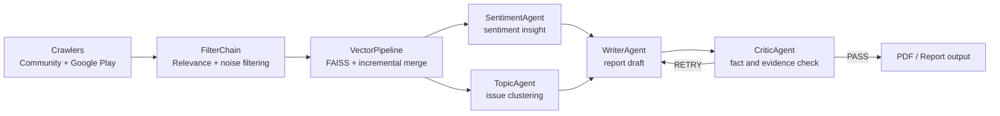

# ENTER-AI

> AI agents that turn noisy public feedback into decision-ready product signals.

ENTER-AI is an AI workflow project that collects online feedback, filters noise,
clusters issues, and generates evidence-backed reports with a LangGraph
multi-agent pipeline.

For the SparkClaw application, this repository is positioned as the execution
evidence behind **SignalOps AI**: a B2B SaaS concept that turns app reviews,
community posts, and customer feedback into actionable issue cards for product,
CX, and QA teams.

## Product Direction

**SignalOps AI** is an AI-native ReviewOps agent.

It does not stop at summarizing reviews. It detects repeated customer signals,
groups them into product issues, attaches evidence, estimates confidence, and
prepares the next action for tools such as Slack, Notion, or Jira.

Target users:

- Product managers who need to prioritize real user problems
- CX teams that need recurring complaint patterns
- QA teams that need regression and release feedback signals
- App operators who need early warning on authentication, payment, crash, or CS issues

## Why This Repository Matters

SparkClaw evaluates execution capacity more than idea novelty. This repository
shows that the AI workflow has already been built, measured, refactored, and
tested.

| Evidence | Result |
| --- | --- |
| LangGraph multi-agent workflow | `Sentiment -> Topic -> Writer -> Critic` report generation |
| LLM filtering optimization | 5,113 items: 84.56 min -> 3.94 min, 21.46x faster |
| Crawling optimization | 4-site crawling: about 8 min -> 2.6 min, 2.7x faster |
| Test suite | 33 unit/integration tests were written for core logic |
| Load test | 0% error rate with 5 concurrent users in Locust scenario |
| Data quality audit | Community data limitations were measured before product repositioning |

## Multi-Agent Architecture



The workflow treats AI models as team members:

- **Filter agent**: removes irrelevant or low-quality documents
- **Sentiment agent**: extracts sentiment distribution and interpretation
- **Topic agent**: turns clustered documents into issue-level insights
- **Writer agent**: writes the structured report
- **Critic agent**: checks whether the draft cites numbers, topics, and evidence

## Current Repository Guide

| Path | Purpose |
| --- | --- |
| `project/server/modules/report_agent.py` | LangGraph multi-agent report workflow |
| `project/server/modules/chain_pipeline.py` | RAG, sentiment analysis, and PDF report generation |
| `project/server/modules/topic_pipeline.py` | FAISS + KMeans topic clustering |
| `project/server/modules/vectordb_pipeline.py` | FAISS store creation, deletion, and incremental merge |
| `project/filter_pipeline/filter_chain.py` | LLM-based relevance filtering |
| `crawler/` | Scrapy/Splash and Google Play crawling assets |
| `tests/` | Unit, integration, benchmark, and load-test scripts |
| `docs/project_history.md` | Execution history and major technical decisions |
| `docs/review_signal_agent_spec.md` | Product spec for the Review Signal Agent direction |
| `docs/sparkclaw_submission.md` | Submission positioning and application summary |

## Technical Stack

- Python, FastAPI, Pydantic
- LangGraph, LangChain, OpenAI models
- FAISS, OpenAI embeddings, scikit-learn KMeans
- Scrapy, Splash, Google Play scraper
- ReportLab, Mermaid
- pytest, pytest-asyncio, FastAPI TestClient, Locust

## Run Locally

This project uses `uv`.

```bash
uv sync --extra dev
uv run --extra dev python -m pytest
```

Live crawling and LLM report generation require environment variables such as
`OPENAI_API_KEY`. Unit and integration tests are designed to mock external LLM
calls where possible.

## SparkClaw Submission Summary

Recommended application framing:

- **Company / solution name**: SignalOps AI
- **Industry tags**: A.I., SaaS, Data Analytics
- **One-liner**: AI agents that convert app reviews and customer feedback into
  issue cards, evidence, and product-team actions.
- **Core proof**: ENTER-AI already implements the underlying agentic workflow,
  async LLM optimization, RAG, crawling, tests, and benchmark history.

More details are in [`docs/sparkclaw_submission.md`](docs/sparkclaw_submission.md).
